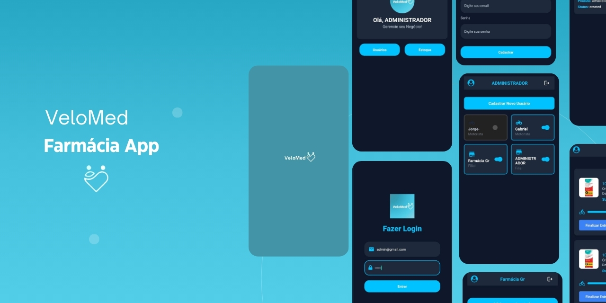

# VeloMed - Farmácia App



## Descrição do Projeto

**VeloMed** é um aplicativo desenvolvido para uso interno de uma empresa farmacêutica, com o objetivo de otimizar o gerenciamento de produtos e o acompanhamento de entregas. Este sistema oferece uma interface amigável e intuitiva, permitindo o cadastro, listagem e movimentação de produtos, além de funcionalidades específicas para motoristas.

O aplicativo foi projetado para facilitar o fluxo de trabalho da equipe interna, com telas interativas que oferecem:

- **Tela de Login**: Acesso seguro e rápido ao sistema.
- **Home Dinâmica**: Navegação fácil entre as seções, incluindo listagem de produtos e gerenciamento de usuários.
- **Cadastro e Listagem de Usuários**: Controle completo de usuários, com pesquisa eficiente para rápida localização de registros.
- **Gestão de Movimentações**: Acompanhamento de entregas e funcionalidades específicas para motoristas, otimizando a logística de transporte.

## Tecnologias e Bibliotecas Utilizadas

O desenvolvimento deste projeto utilizou diversas bibliotecas e tecnologias modernas para assegurar desempenho e funcionalidade no ambiente React Native com Expo:

- **@react-navigation/native**: Para navegação intuitiva entre telas.

```bash
npm install @react-navigation/native
```

- **react-native-screens e react-native-safe-area-context**:Melhoram o desempenho e layout das telas no dispositivo.

```bash
npx expo install react-native-screens react-native-safe-area-context
```

- **@react-navigation/stack**:Para criação de navegação em pilha.

```bash
npm install @react-navigation/stack
```

- **Axios**:Para comunicação com a API e obtenção de dados.

```bash
npm install axios
```

- **@react-native-async-storage/async-storage**: Armazenamento local para manter dados persistentes.

```bash
npx expo install @react-native-async-storage/async-storage
```

- **@react-native-picker/picker**:Picker para seleção de opções em formulários.

```bash
npx expo install @react-native-picker/picker
```

- **Lottie para React Native**:Animações para uma interface mais atrativa.

```bash
npx expo install lottie-react-native
```

- **expo-image-picker**:Para seleção e upload de imagens.

```bash
npx expo install expo-image-picker
```

- **react-native-maps**:Para visualização de mapas e rastreamento de entregas.

```bash
npx expo install react-native-maps
```
